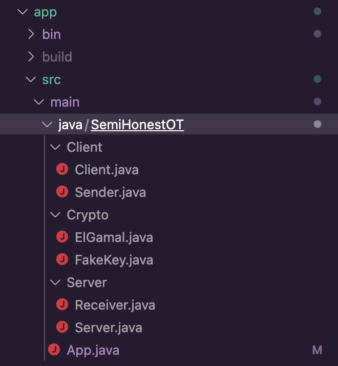

# Semi-honest oblivious transfer using ElGamal

My final project for the Cryptographic Computation and Blockchain university course.


# Description of the protocol

The original protocol is a simple public key-based semi-honest OT as
described in [Evans18 [1]](#1).

*Parameters:*

1.  Two parties: Sender ***S*** and Receiver ***R***.
    S has input secrets $X_1, X_2, \in \{0, 1\}^n$, and ***R***
    has a selection bit $\textit{b}, \in \{0, 1\}$.

*Protocol:*

1.  ***R*** generates a public-private key pair *sk, pk* and
    samples a random key, *pk'*, from the public key space. If
    $\textit{b} = 0$ ***R*** sends a pair (*pk', pk*) to
    ***S***. Otherwise (if $\textit{b} = 1$), ***R***
    sends a pair (*pk, pk'*) to ***S***

2.  ***S*** receives ( $pk_0, pk_1$ ) and sends back to
    ***R*** two encryptions
    $e_0 = ENC_{pk_0} (X_0), e_1 = ENC_{pk_1} (X_1)$.

3.  ***R*** receives ( $e_0, e_1$ ) and decrypts the ciphertext
    $e_b$ using *sk*. ***R*** is unable to decrypt the second
    ciphertext as it does not have the corresponding secret key.

In my implementation, the input secrets $X_1, X_2$ are *Strings*,
between 0 and 256 characters.

# Implementation

The implementation is purely written in Java, using Gradle as a build
tool with only one external dependency:

    implementation 'org.bouncycastle:bcprov-jdk15on:1.65'

The project is structured into three packages, representing the two parties and the
classes associated with the public-key cryptography. The class
*App.java* is acting as a main/test class, where the protocol is running
offline.



## Crypto package

The Crypto package holds the classes needed for the
private-public-random key generation and the functions for
encryption/decryption. In order to leverage the already existing ElGamal
implementation of the Java security package and the BouncyCastleProvider
I created a FakeKey class, which implements the ElGamalPublicKey
interface, representing the random public key generated during the
protocol.

### ElGamal.java

The purpose of the ElGamal class is to generate the public-private
keypair, the random public key and to encrypt and decrypt the secrets.
It has three parameters:

``` {.java language="Java"}
private Cipher cipher;
    private KeyPairGenerator generator;
    private SecureRandom random;
```

In the constructor we initalize the cipher with the
BouncyCastleProvider's ElGamal implementation, using *no padding*, the
key pair generator, also using the ElGamal implementation of the
BouncyCastle library with a *key size of 2048-bit*. Since the amount of
data we can encrypt with ElGamal is $$\frac{KeySize + Padding}{8}$$ The
maximum length of the the message we can encrypt is 256-bit. The ElGamal
class has four public methods:

``` {.java language="Java"}
public KeyPair generateKeyPair()
```

A function for generating an ElGamal public-private key pair.

``` {.java language="Java"}
public byte[] encrypt(Key publicKey, byte[] message)
    public byte[] decrypt(Key privateKey, byte[] cipherText)
```

Functions for encrypting and decrypting our messages.

``` {.java language="Java"}
public FakeKey generateRandomPublicKey(BCElGamalPublicKey pubKey)
```

The functions returns a FakeKey object, from the generator and prime
modulus of the public key *pubKey* we supplied as a parameter. Since
ElGamal public keys are just group elements of a multiplicative cyclic
group, we can take a random element of this group and use it as a public
key, without actually knowing the corresponding private key.

This is how the BouncyCastle library generates the ElGamal public key,
where ***x*** is the private key and ***dhParams.getP()*** is the prime
modulus:

``` {.java language="Java"}
BigInteger calculatePublic(DHParameters dhParams, BigInteger x)
    {
        return dhParams.getG().modPow(x, dhParams.getP());
    }
```

Since ${G^x}\mod{p}$ will always return a number between 0 and $p-1$, we
can just grab a random number between these intervals, and use it as our
public key. We will generate this random number using the
createRandomInRange function of the BigInteger class, and creating a
FakeKey object with it, alongside of the already existing parameters of
the supplied pubKey.

### FakeKey.java

The FakeKey class is just an implementation of the ElGamalPublicKey
interface. It's a public key which is fully compatible with the Cipher
class we use, without having an associated private key with it.

## Client package

The Client package holds our Sender (***S*** in our protocol)
and a simple client class, which is able to communicate with our Server
using simple java sockets.

### Sender.java

Our Sender class has two parameters:

``` {.java language="Java"}
private byte[][] message;
    private ElGamal elGamal;
```

The two dimensional message array represents our two secrets $X_1, X_2$
while the aforementioned ElGamal class is needed to encrypt these
secrets. The Sender class has only one function

``` {.java language="Java"}
public byte[][] getEncrypted(PublicKey[] publicKeys)
```

which basically returns $e_0, e_1$ where
$e_0 = ENC_{pk_0} (X_0), e_1 = ENC_{pk_1} (X_1)$.

### Client.java

The client class will initialize our Sender with two String inputs
( $X_1, X_2$ ) from the user. ***After we have our Sender object***, the
client will connect to our Server using a java socket. From here the
flow of the protocol is this:

1.  We get the public keys $pk_0, pk_1$ from the server as Base64
    encoded strings, which we are going to convert to Public Keys using
    a KeyFactory class.

2.  We encrypt our secrets $X_1, X_2$ with the public keys and sending
    it back to the server as Base64 encoded strings.

3.  We close the connection

## Server package

The Server package holds our Receiver ***R***, and a simple
java Server used for sending data between the client and the server.

### Receiver.java

The Receiver has three parameters:

``` {.java language="Java"}
private ElGamal elGamal;
    private KeyPair keyPair;
    private FakeKey fakeKey;
```

We use the ElGamal class to generate our KeyPair and our FakeKey. The
class has two public functions:

``` {.java language="Java"}
public PublicKey[] getPublicKeys(boolean choiceBitBoolean)
```

The parameter *choiceBitBoolean* is representing the selection bit *b*.
I've choosen to use *boolean* as the data type for this, emphasizing
that $\textit{b}, \in \{0, 1\}$. (In Java the size of the primitive data
type *boolean* is actually 1 bit) The function will initialize an
ElGamal object and create our KeyPair and FakeKey. After this, it will
return a PublicKey array of size 2, holding our *'real'* and *'fake'*
public keys, where the index of our *'real'* public key equals our
selection bit. The other public function

``` {.java language="Java"}
public byte[][] decryptMessages(byte[][] encryptedMessages)
```

will decrypt the messages in the encryptedMessages array using the
private key we generated with the *getPublicKeys* function.

### Server.java

The flow of the Server class is the following:

1.  We initialize our Receiver ***R***

2.  We're creating a server socket, and waiting for the client to
    connect.

3.  After the client has connected, we get our selection bit *b* from
    the user.

4.  We are creating the public keys, using the *getPublicKeys* method of
    the Receiver class. We send them over to our client as Base64
    encoded strings.

5.  We receive our encrypted messages $e_0, e_1$ as Base64 encoded
    strings.

6.  We're decoding them and storing the ciphertexts in a two dimensional
    byte array.

7.  We're trying to decrypt them, using the *decryptMessages* method of
    the Receiver class and our private key *sk*.

Since only one of the messages got encrypted with the public key *pk*
corresponding to our secret key *sk*, we won't be able to read the other
message.

## App.java

This class acts as an entry point of the application, in case we don't
want to run the protocol trough a network (by running Server.java and
Client.java simultaneously). It initializes the Receiver
***R*** and the Sender ***S***, taking the secrets
$X_1, X_2$ and
the selection bit *b* as user inputs. After this, it will go trough the
steps of the protocol, displaying the deciphered messages at the end.

# Conclusion

If nobody derives from the protocol, the Sender ***S*** will
not be able to learn the selection bit of the Receiver ***R***,
since it only received two public keys, while our Receiver
***R*** can only decrypt one of the messages, because it only
has the corresponding private key *sk* for one of the public keys. Thus
this oblivious transfer is secure against semi-honest adversaries. In
order to break the encryption $e_{b-1}$, the Receiver would have to
break the discrete logarithm assumption, making the protocol
computationally secure. [[2]](#2) Implementing this
protocol as a 2nd semester Software Design student helped me to better
understand a very important building block of many secure multiparty
computations. Since the concepts were very new to me, the project
probably contains many sub-optimal solutions (like the existence of the
FakeKey class, which I only use to easily generate a public key) with a
lot of room for improvement.

# References

<a id="1">[1]</a> 
David Evans, Vladimir Kolesnikov, and Mike Rosulek.
A pragmatic introduction to secure
multi-party computation.
Found. Trends Priv. Secur., 2(2–3):70–246, dec 2018.

<a id="1">[2]</a> 
Taher ElGamal.
A public key cryptosystem and a signature scheme based on discrete logarithms.
In George Robert Blakley and David Chaum, editors, Advances in Cryptology, pages
10–18, Berlin, Heidelberg, 1985. Springer Berlin Heidelberg.
5


# Demo

## Online
The workings of the protocol, where the Receiver acts as a Server and the Sender as a Client.

## Offline
Demonstration of the protocol offline, initializing the Sender and Receiver class directly

